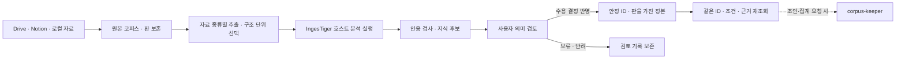

# IngesTiger Wiki 운영

설정 → 데이터 → 보존한 자료 → **Wiki 분석·정본**에서 사용합니다. 현재 pin은 [manifest](../../vendor/ingestiger/manifest.json)의 `2c4a74b6c9a40cb747c8e24b2a535b4457cdf3f2`, `1.0.0-draft.6`입니다.



원본·추출물의 코퍼스와 검토된 Wiki 정본은 별도 저장소입니다. 검색의 1,200자 조각을 지식 단위로 삼지 않고 절·슬라이드·표 행을 전달합니다. 자료 크기·미디어 보류 정책은 [원본 판독 안내](../../docs/corpus-source-reader.md)를 따릅니다.

## 사용 순서

1. 자료를 등록하고 기업·프로젝트 ID를 입력합니다. 여러 기업의 내용이 섞인 파일이면 해당 기업의 구조 단위만 선택합니다. 선택 범위의 소유를 확인하고 **분석 요청 준비**를 누릅니다.
2. 준비된 요청 하나를 선택해 **선택한 요청 분석 실행**을 누릅니다. 현재 Claude 로그인과 호스트 모델을 사용하며 계정 사용량을 소모합니다. 모델은 도구·MCP 없이 JSON 후보만 생성합니다. 이미 후보가 저장된 요청을 다시 누르면 기존 결과를 반환합니다. 실패한 요청은 실패 기록을 남기며 사용자가 다시 실행합니다.
3. 인용·단위 누락·중복 검사를 통과한 후보에서 지식 하나를 선택합니다. 전체 구조 단위, 후보 문장, 금액·날짜·조건·예외를 대조합니다. 다른 절이나 첨부의 미확인 조건은 판단 근거에 남깁니다.
4. 새 지식이면 반영 대상을 비워 둡니다. 같은 대상·업무의 갱신이면 기존 정본 ID를 선택하고 이전 조건을 확인합니다. 수용/보류/반려와 판단 근거를 기록합니다. `수용`에는 조건 대조 확인이 필요합니다. 원문 해석이 모호한 단위는 먼저 새 후보로 해소해야 합니다.
5. **기록된 수용 결정을 정본에 반영**을 누릅니다. 저장된 검토 결정에 결합된 후보·대상·기준 판을 사용합니다. 화면은 저장 후 같은 ID·판을 다시 읽습니다. 새로운 검토가 기록됐거나 원본·기준 snapshot이 달라졌으면 이전 쓰기를 거절합니다. 최신 내용을 읽고 다시 검토하세요.
6. 같은 기업·프로젝트의 작업을 불러오면 프로젝트 정본 목록과 검토 이력을 다시 볼 수 있습니다. 원본이 변경되면 정본에 재검토 표시를 합니다. 접근이 철회되거나 자료를 검색에서 제외하면 정본 조회에서도 해당 자료를 숨깁니다.

**수용/current는 제공할 지식 판의 선택입니다.** 업무 승인·외부 사실 검증으로 바뀌지 않으며 `claim_status=source_reported`를 유지합니다. 적용 기간은 unknown, 다른 절의 의존 조건은 unverified입니다. 보류·반려는 기록만 남깁니다. 후보 작업의 `published=false`는 불변 후보 상태이고, 정본 반영 결과는 별도 지식 ID와 snapshot으로 확인합니다.

수동 LLM을 사용하려면 요청을 복사하고 응답 JSON을 제출할 수 있습니다. 이 경로에도 같은 검사가 적용됩니다. 자동 실행은 `INGESTIGER_MODEL`, 없으면 `MYCREW_AI_GW_DEFAULT_MODEL`, 없으면 `claude-haiku-4-5`를 사용합니다. 모델 표기가 현재 호스트와 다른 과거 요청은 수동 응답으로 처리하거나 새 요청을 만드세요. 자동 재시도와 다른 공급자로의 유료 전환은 수행하지 않습니다.

## 역할과 실행 경계

신규 `ingest-crab` 배정과 그 라우팅 결과는 `ingestiger`로 연결합니다. 이미 저장된 작업·직원 ID·역할 이력은 이전하지 않습니다. `corpus-keeper`는 조인·계산이 요청된 경우에만 정본 ID·판·근거를 받아 데이터셋을 만드는 담당입니다.

이 화면은 IngesTiger 역할과 단위 분석 프롬프트를 사용하는 제한된 호스트 실행기입니다. 자유 형식 직원 대화의 `createJob` 실행과 분리됩니다. 일반 직원에게 Bash, 공유 Wiki 폴더 쓰기, 정본 반영 권한을 추가하지 않았습니다. 일반 직원과 Genie의 MCP 기반 Wiki 조회·인계·사용 기록은 연결되어 있습니다. 실행 경로와 권한은 [직원 협업 운영 안내](../../docs/ingestiger-agent-collaboration.md)를 따릅니다. 기존 Ask 검색은 정본을 자동 검색하지 않습니다.

관계·필수 조건의 자동 대조, 그래프/벡터 리랭킹 고도화, 의미상 활용 검증, 정본 은퇴·일괄 병합, Drive 쓰기 동기화는 후속 범위입니다. [전체 설계](../../docs/ingestiger-workflow-design.md)와 이 구현 범위를 구분합니다.

## 저장과 복구

```text
history/
  corpus/<source-id>/<source-revision>/original.bin
  wiki/organizations/<org-id>/projects/<project-id>/
    changes/<job-id>/preparation.json
    changes/<job-id>/candidates/<candidate-hash>/...
    changes/<job-id>/analysis/<attempt-id>.json
    changes/<job-id>/analysis/<attempt-id>.response.txt
    reviews/<review-hash>.json
    reviews/head-<candidate-unit-hash>.json
    snapshots/<manifest-hash>/
      manifest.json
      knowledge/K-<uuid>.md
      reviews/<review-hash>.json
      relations.json
      index.md
    journals/<review-hash>.json
    current.json
    writer.lock                    # 작업 중에만 존재
```

`MYCREW_HOME`을 지정하면 그 아래 history를 사용합니다. 지식 Markdown의 JSON frontmatter가 값의 정본이며 본문은 읽기용 표현입니다. snapshot 안에 지식·검토 기록·목차·빈 관계 상태를 함께 보존합니다. 검색 색인을 별도 사실 저장소로 만들지 않습니다.

긴 모델 호출은 정본 잠금 밖에서 실행합니다. 반영은 프로젝트 writer lock 아래 기준 snapshot·원본을 재검사하고, 모든 파일의 해시를 readback한 뒤 journal을 기록하고 current.json을 교체합니다. 이전 snapshot은 보존합니다. 반영 직전 실패하면 이전 current를 유지합니다. 포인터 전환 직후 응답을 잃어도 같은 검토 ID로 재시도하면 중복 판을 만들지 않습니다. 파일 flush와 이름 변경을 사용하지만 Windows 실기기의 교체 실패·정전 내구성 검증은 별도입니다.

중단 후 `writer.lock` 또는 `analysis/<request-id>.lock`이 남으면 자동 삭제하지 않습니다. PID만으로 잠금 소유자의 종료를 추정하지 않습니다.

1. 해당 설치의 MyCrew 서버와 Wiki 분석 프로세스를 모두 종료합니다.
2. 설정의 전체 데이터 백업 또는 history 폴더 사본을 확보합니다. 후보 ZIP에는 정본·검토·분석 기록이 포함되지 않으므로 전체 백업을 사용합니다.
3. 대상 기업·프로젝트의 current.json, 해당 snapshot manifest와 파일, journal, 잠금의 시각·작업 ID를 대조합니다. current나 manifest가 없거나 손상됐다면 임의로 최신 폴더를 선택하지 말고 백업과 대조합니다.
4. 활성 실행이 없고 잠금이 중단된 작업의 잔여물임을 확인한 경우에만 **그 잠금 파일 하나**를 제거합니다. snapshot·journal·원본은 삭제하지 않습니다.
5. 서버를 시작하고 같은 작업을 불러옵니다. 같은 검토 ID로 반영을 재시도하면 prepared journal을 완료하거나 이미 반영한 판을 재조회합니다. 그사이 다른 판이 반영됐다면 새 기준 판에서 재검토해야 합니다.

단일 설치 소유자용 기능입니다. 기업·프로젝트 폴더는 다중 사용자 ACL을 대신하지 않습니다. API는 기존 로컬 접속/SSO·동일 출처 검사와 원본 접근 검사를 사용합니다. Drive 연결 철회 후 전체 복구 백업에 과거 파일이 남는 것은 기존 설치 소유자의 백업 정책입니다.

## 실행 환경과 API

Python 3은 표준 라이브러리만 사용합니다. Windows 기본 실행명은 python이며 다른 경로는 `.env`의 `INGESTIGER_PYTHON`에 인자 없이 지정합니다. `python --version`, `py -3 -c "import sys; print(sys.executable)"`로 설치 경로를 확인할 수 있습니다. Mac의 `.env`와 node_modules를 자동 복제하지 않습니다. [Windows 검사 명령](../../README-WINDOWS.md)을 따르세요.

| API | 기능 |
|---|---|
| `GET /api/wiki/capabilities` | Python·pin 검사, 실행 모델 표기. 실제 로그인/모델 성공은 미검사 |
| `POST /api/wiki/prepare` | source ID·판·선택 단위로 범위가 고정된 요청 생성 |
| `POST /api/wiki/jobs/:id/analyze` | scope·requestId로 선택 요청 하나 실행 |
| `POST /api/wiki/jobs/:id/submit` | 수동 response 검사·후보 저장 |
| `GET /api/wiki/jobs` / `GET /api/wiki/jobs/:id` | scope·sourceId를 지정한 작업 조회 |
| `GET /api/wiki/jobs/:id/reviews` | 작업의 검토 기록 조회 |
| `POST /api/wiki/reviews` | 후보·대상 ID·기준 snapshot·판단 근거·결정 기록. 검토자는 서버 인증 정보로 기록 |
| `POST /api/wiki/commit` | scope·reviewId에 결합된 수용 후보 반영 |
| `GET /api/wiki/knowledge` / `GET /api/wiki/knowledge/:id` | scope 내 정본 목록·ID별 현재 판·조건·근거 조회 |
| `GET /api/wiki/jobs/:id/backup` | 요청·후보 ZIP만 제공 |

GET의 범위는 `orgId`·`projectId` 쿼리로 지정합니다. prepare/submit의 기존 계약은 유지합니다. 후보 문구가 권한·저장 경로·승인자·정본 판을 지정할 수 없습니다. 리뷰는 프로젝트당 2,000개까지이며 snapshot 출력 한도 초과는 실패로 남깁니다.

```bash
npm run verify:ingestiger
npm run test:ingestiger-role
npm run test:wiki-product
npm run test:wiki
npm run build
```

`test:wiki-product`는 실제 Python·호스트·파일 저장과 합성 모델 응답/검토 결정을 사용합니다. `preview:wiki`는 임시 자료에서 실제 화면/API를 사용하는 브라우저 검증용 서버이며 실제 AI를 호출하지 않습니다. 이 검사는 실제 회사 문서의 의미 품질, 실제 Claude 로그인, Windows 운영, Drive 쓰기 성공을 증명하지 않습니다.

## 실제 호출 확인과 배포

2026-09-14 Mac의 기존 Claude 로그인으로 합성 자료를 실제 호출했다. 원문 언어를 보존하도록 draft.6을 보완하고 재호출·인용 검사를 통과했다. 의미 조건이 부족한 후보는 보류하고 적용일 후보의 정본 반영·ID 재조회만 검증했다. [실호출 기록](../../docs/ingestiger-live-release.md). Windows 실제 실행은 별도다.

명시적으로 실제 모델 호출을 검사하려면 `npm run test:wiki-live -- --confirm-real-call --output <report.json>`을 실행한다. 계정 사용량을 소모하며 합성 자료와 별도 임시 history를 사용한다. 결과 보고서는 후보를 포함하므로 로컬에 보관한다.

## 일반 직원의 조회·인계·인용 기록

[직원 협업 운영 안내](../../docs/ingestiger-agent-collaboration.md)를 따른다. WikiSearch·WikiRead·WikiHandoff·WikiRecordUsage를 일반 Claude 직원과 Genie에 연결했다. 기존 읽기 권한을 확인하며, 정본 화면에서 인용한 결과물과 변경 상태를 조회한다. 추가 검사는 `npm run test:wiki-collaboration`이다. 실제 다중 모델 협업·Windows PTY 실행은 별도 검증이 필요하다.
