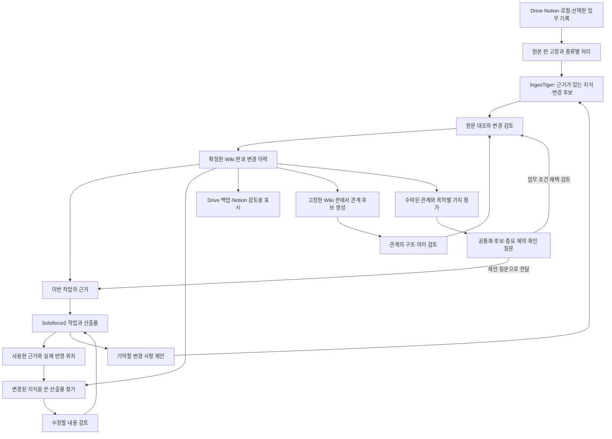

**IngesTiger와 Soloforce2: 근거와 결정을 다음 업무로 이어가는 설계**

2026-09-14 역할·계약·직원 연결 반영은 [역할 반영 확인](ingestiger-role-verification.md)에 기록했습니다. 고정 번들은 [manifest](../vendor/ingestiger/manifest.json)가 관리합니다. 아래 과거 commit과 검증 기록은 당시의 범위이며, 정본 승격·조건 조회·사용 기록 자동화는 여전히 후속 구현입니다.

2026-09-13 · 설계 제안 v2 · 온톨로지·목적별 가치 판별을 보강한 문서이며 제품 기능 구현 완료를 뜻하지 않습니다.

목표는 같은 고객사의 다음 일을 시작할 때 이전 결정을 다시 설명하는 수고와 오래된 조건 때문에 생기는 재작업을 줄이는 것입니다. IngesTiger가 원본에서 지식과 변경 후보를 만들고, Soloforce2가 검토·확정·업무 적용·영향 확인을 연결합니다.

직접 읽은 [공유 세션: Kuku 로드맵 설계철학 분석](https://chatgpt.com/s/cx_6aa65cc6448481919cf3ed69f5070fa2)을 제품 방향의 근거로 삼았습니다. 세션의 경쟁 제품 분석을 이번에 독립적으로 성능 검증한 것은 아닙니다. 제품 가격이나 프레임워크 교체를 설계의 전제로 삼지 않습니다.

추가로 [공유 세션: 재작성 role-directive.md](https://chatgpt.com/s/cx_6aa671b6a180819185daba0235a57a62)의 후반 온톨로지·가치 판별 제안을 직접 읽었습니다. Wiki 적재 후 관계를 검토하는 단계, 근거와 처리 과정의 추적, 목적별 평가를 아래 설계에 통합했습니다. 세션에 인용된 과거 고객사 분석·성능·배포 결과는 이번에 다시 실행한 검증으로 취급하지 않습니다.

v1 작성 당시 코드 대조 기준은 Soloforce2 `27fe7bb1e33d604f5a20e0f666a2ed90c51272b2`와 그 위의 로컬 후보 어댑터 커밋 `a7b54a378c100b73a30a3db9541951e80aef4bdb`, IngesTiger `dd10e86859d16c3170f6075f2b5b19b1438baceb`입니다. 실행 경로 중심 조사이며 저장소 전체의 전수 검토는 아닙니다. 후보 어댑터는 로컬에 있고 원격 main에는 반영되지 않았습니다.

초기 설계 대조 기준은 Soloforce2 `fe427d67267f4f49f63e7641274fa7730807994d`였습니다. 구조 읽기 도입 시점의 구현은 `codex/ingestiger-wiki-adapter`와 고정 IngesTiger `4c876bbecd0f727386c792976dee21479328cac1`입니다. 이 코드는 후보 생성·검증까지 제공하며 아래 온톨로지 실행·평가는 후속 구현입니다.

**공유 세션을 반영한 결정**

| 세션에서 가져온 요구 | 이번 설계에서의 구체적인 처리 |
|---|---|
| 다시 설명하고 고치는 부담을 줄인다 | 첫 사례를 ‘같은 고객사의 두 번째 교육 제안서’로 고정하고 재설명·오적용·검토시간을 측정 |
| 변경 이유·근거·영향을 함께 본다 | 변경 전후 조건, 원문 위치, 영향받는 산출물, 미결정을 하나의 변경안으로 표시 |
| 일부만 수락할 수 있다 | 교육시간 변경과 실습 삭제를 독립 작업으로 만들고 선택한 작업 묶음에만 검토 결정을 연결 |
| 새 작업에서 현재 조건과 폐기 조건을 구분한다 | 적용할 확정 조건·지난 작업 후 변경·사용 중단 조건·미결정 질문을 작업 근거 묶음에 제공 |
| AI가 잘못 기억한 내용을 정정할 수 있다 | 안정 지식 ID에 새 판을 추가하고, 이전 판을 참조한 실제 산출물까지 역추적 |
| 다른 에이전트도 같은 근거를 쓴다 | 대화 요약을 다시 복사하는 대신 같은 context packet ID와 근거 판을 전달 |
| AI가 없어도 자료에 접근한다 | 원본·정본 Markdown·목차를 로컬에서 읽고 검색할 수 있게 유지 |
| 긴 작업 도중 바뀐 조건을 놓치지 않는다 | 지식 변경 사건을 구독하고 단계 전환·최종 저장 직전에 사용 판을 재확인 |
| 데이터의 통제·복구·이전을 보장한다 | 로컬 완성판을 기준으로 내보내기와 Drive 복제를 수행하고, 원격 재읽기로 같은 판인지 확인 |
| Wiki 적재 후 업무 관계를 검토한다 | 고정한 Wiki 판에서 개체·속성·관계 후보를 만들고 동일성·유사 기능·순서·제약을 분리 |
| 가치 판단의 근거를 설명한다 | 공통화 후보·중요 제약·확인 우선 질문으로 출력하고 목적별 기준·반증·미상값을 기록 |
| 결과와 처리 과정을 모두 추적한다 | 원본까지의 근거 연결과 처리 단계·규칙·모델·검토 이력을 별도로 기록하고 변경 영향 계산 |

이전 ‘공통 코퍼스 + PostgreSQL’ 설계는 검색 확장 방향으로 보존합니다. 이번 첫 구현은 **로컬 LLM Wiki와 기존 검색을 연결하는 범위**로 좁힙니다. 새로운 DB 서버 설치나 벡터 모델이 없어도 아래 업무 흐름을 완주해야 합니다.



2026-09-14 제품 반영에서는 원본 선택 → 요청 준비 → 호스트 모델 실행 → 후보 → 인간 의미 검토 → 단일 후보의 안정 ID·snapshot 반영 → ID 재조회를 연결했습니다. 현재 운영 계약은 [Wiki 안내](../config/wiki/README.md)입니다. 그림의 작업 근거 자동 전달·반영 위치·영향 확인·관계 검토·가치 평가·Drive 복제는 후속 범위입니다.

**현재 기반과 반드시 보완할 경계**

| 현재 확인한 코드 | 재사용할 부분 | 추가 설계가 필요한 부분 |
|---|---|---|
| [자료 구조](../src/shared/corpus.ts), [형식 판별·추출](../src/server/corpus/extract.ts) | 원본 ID·해시·추출 판·위치·추가 처리 상태 | 표의 논리 블록, 발표자료의 슬라이드 문맥, 업무 종류 복수 분류 |
| [Wiki 후보 서비스](../src/server/wiki/service.ts), [사용 안내](../config/wiki/README.md) | 고정 upstream 호출, 명시적 기업·프로젝트 범위, 후보 무결성·원본 재검사 | stable knowledge ID, 의미 검토, 변경안, current 승격 |
| [자료 검색](../src/server/corpus/search.ts) | 키워드·선택적 로컬 벡터·사용자 분류의 RRF 결합 | 근거가 있는 업무 관계와 적용 상태를 함께 다루는 검색 |
| [통합 검색](../src/server/ai-search.ts) | 자료실·기존 개인/직원 위키·corpus 검색 | 검색 결과의 문장을 업무 확정 조건과 구분해 전달하는 계약 |
| [선별 회상](../src/server/memory/recall.ts) | 기존 세션 시작 시 회상 경로 | 기본 OFF인 기능 플래그와 별개로 작업 근거 묶음 전달·작업 도중 갱신 |
| [기억 그래프](../src/server/memory/graph.ts), [기존 스키마](../src/server/memory/schema.ts) | 시간 이력 조회에 대한 참고 구현 | 현재 이름+타입 식별은 조직 범위가 없고, addFact는 같은 주어·관계의 이전 값을 자동 종료함. 신규 업무 지식 쓰기에 바로 사용하지 않음 |
| [작업 실행](../src/server/jobs.ts), [결과 화면](../src/client/components/Jobs/JobResultModal.tsx) | 작업 ID, 산출물 파일 목록, 위임·이어받기 | 파일의 판·어느 부분에 무엇을 적용했는지에 대한 기록 |
| [기존 변경 장부](../src/server/reversible-ingest.ts) | 준비·현재판 비교·journal 방식 | Wiki 파일 묶음·승인·후속 사건을 포함하는 공통 commit 구현과 Windows 장애 검증 |

현재 `addFact`는 제품 실행 경로에 연결된 호출자를 이번 검색에서 찾지 못했습니다. 시간 처리 함수의 존재를 업무 지식 자동 갱신 기능으로 보고하지 않습니다. 기존 개인/직원 기억과 회사 업무 Wiki는 서로 다른 저장 책임으로 유지합니다.

**첫 입구: 파일 형식과 업무 의미를 두 번 구분합니다**

첫 판별은 확장자·MIME·파일 시그니처·컨테이너 구조·도구 가용성으로 수행합니다. 그 뒤 읽을 수 있는 원문에만 업무 의미를 분류합니다. ‘회의록’이라는 파일명만으로 문장을 확정 결정으로 만들지 않습니다. 하나의 원본에 표·본문·이미지가 섞이면 여러 처리 경로와 각각의 처리 범위를 기록합니다.

| 데이터 종류 | 읽기 단위와 보존 정보 | 이후 경로 |
|---|---|---|
| DOCX·텍스트 PDF·Notion 본문 | 제목 계층, 문단·표, 페이지/블록 ID, 조건·부정·예외 | 사실·니즈·결정·제약·질문 후보 |
| XLSX·CSV·Notion 표 | 시트·셀/행 좌표, 헤더, 병합 근거, 셀 문자열·수식 여부·단위 | 구조화 조회와 지식 후보를 함께 생성. 숫자·합계는 검증 가능한 계산 경로 사용 |
| 회의 오디오·전사 | 오디오 판, 발화 시각, 화자 확인 상태, 정정 판 | 전사 후 결정 제안·담당·질문 추출. 부분 자막은 확정 지식 입력에서 제외 |
| 이미지 레퍼런스 | 원본 바이트와 최소 메타데이터 | 기본은 보관·참조. 필요한 작업에서만 선택적으로 시각 분석 |
| 스캔·내용 확인용 이미지 | OCR 위치, 도구·판, 미판독 영역 | OCR 가능 시 원문 대조 후 후보. 레퍼런스 보관과 별도 경로 |
| PPTX·Keynote·큰 자료 | 컨테이너 목록, 슬라이드 순서, 노트·매체·도표 존재, 읽은 범위 | 필요한 슬라이드만 변환·분석. 미지원 변환과 용량 초과는 보류 |
| 암호화·손상·미지원 파일 | 원본 식별자, 실패 이유, 해결에 필요한 조건 | 원본 보존 후 pending/quarantine. 읽지 않은 내용을 추정하지 않음 |

구조 읽기 구현판은 일반 파서의 20 MiB 경로와 별도로 원본 최대 512 MiB의 분할 접수·진행 위치 보존을 제공합니다. `SourceUnit`에 전체 절·슬라이드·표 행과 제목·헤더를 보관하고, 1,200자 검색 청크는 그 단위를 참조합니다. Wiki 준비에는 구조 단위를 전달하며 예산을 넘는 단위는 자르지 않고 보류합니다. Ask는 검색 후 부모 단위를 펼쳐 읽습니다. 이웃 절·표 밖 각주·Notion의 다른 블록까지 논리적으로 결합하는 단계는 미구현입니다. [구현 범위와 한도](corpus-source-reader.md)를 기준으로 해석하세요.

기업·프로젝트는 등록 ID를 선택합니다. 여러 기업이 섞인 문서는 단위별 소유 범위를 나누며, 불명확하면 미지정으로 남깁니다. 앞서 선택한 범위는 후속 작업에 재사용하고 실제로 범위가 달라졌을 때만 다시 확인합니다.

**각 계층이 확정하는 정보**

| 계층 | 기준 데이터 | 확정 책임 |
|---|---|---|
| 업무 원본 | Drive 파일, Notion 페이지, 로컬 자료, 선택한 대화/작업 기록의 판 | 원래 작성 주체의 자료. Wiki 승격으로 원본을 수정하지 않음 |
| IngesTiger 공통 코어 | 구조 추출, 후보, 지식 계약, 원문 대조 결과, 변경안과 완성 snapshot | 동일 입력·검토 결정에 대한 일관된 결과와 저장 검증 |
| 실행 호스트 | 로그인 주체, 선택 범위, 모델 연결, 허용 도구·경로, 검토 결정의 전달 | 기본 CLI에서는 현재 사용자, Soloforce2에서는 인증된 설치 소유자 |
| 업무 Wiki | 원본을 참조한 지식의 stable ID·판·상태·적용 범위 | 공통 commit 경로만 current를 변경 |
| Soloforce2 | 작업 근거, 결과물 판, 적용·검증 기록, 변경 영향 | 어떤 작업에서 어느 지식을 사용했는지 기록 |
| 검색·그래프·벡터 | 지정된 Wiki/source 판에서 만든 색인과 관계 투영 | 탐색과 정렬. 지식 승인 권한은 없음 |
| Drive·Notion의 결과 표시 | 완성 snapshot의 복제 또는 검토용 뷰 | 원본 연결·보관·표시. 별개의 current를 편집하지 않음 |

기존 IngesTiger [데이터 계약](../vendor/ingestiger/4c876bbecd0f727386c792976dee21479328cac1/skills/ingestiger/references/contracts.md)과 [저장 계약](../vendor/ingestiger/4c876bbecd0f727386c792976dee21479328cac1/skills/ingestiger/references/storage.md)을 확장합니다. 공통 schema·의미 검토·commit 로직은 IngesTiger upstream에서 한 번 정의하고 호스트가 그 버전을 고정해 호출합니다. Soloforce2에 별도 의미 엔진을 복제하지 않습니다. draft.5 upstream의 knowledge.py가 단일 후보 정본 파일을 구성하고 호스트가 writer lock·journal·current 교체를 수행합니다. 아래의 관계·일괄 갱신·은퇴는 확장이 필요합니다.

**지식·변경·사용 이력의 최소 계약**

아래는 논리 객체이며 독립 서버나 별도 DB를 하나씩 만들라는 뜻은 아닙니다. 모든 참조는 workspace/org/project 범위를 함께 검사합니다.

| 객체 | 필요한 필드 | 규칙 |
|---|---|---|
| SourceRevision | source_id, source_revision, raw_sha256, provider_revision, original_uri | 원본 ID와 판을 분리. export는 원본 파일과 구분 |
| SourceUnit | extraction_revision, unit_id, locator, text/cells, context_refs, coverage | 파서 변경과 원본 변경을 구분. 큰 표를 자르면 남긴 범위도 기록 |
| KnowledgeRevision | id, revision, kind, owner_scope, statement, details, provenance, claim_status, lifecycle | 제목·행·내용 해시와 독립된 ID. 판별 내용은 불변 |
| Applicability | knowledge_ref, scope, valid_from/to, condition, authority_ref | 현재 저장된 판과 업무상 적용 시점을 구분. 유효일 미상은 unknown |
| SemanticReview | candidate_ref, input_hash, verdict, reviewer, evidence, reviewed_at | supported/contradicted/insufficient는 원문과 해석의 일치 평가 |
| ChangeSet | id, base_snapshot, operations, dependencies, source_refs, content_hash | 새 기록·값 수정·대체·철회·병합을 명시. 승인 입력 전체에 해시 부여 |
| DecisionReceipt | change_hash, accepted_operations, actor, authority, decision, at | 서버/호스트가 작성. LLM 응답의 ‘approved’는 승인 증거가 아님 |
| ContextPacket | id, task_ref, scope, purpose, snapshot_refs, as_of, entries, exclusions, hash | 해당 업무에 전달한 정확한 근거 묶음. 판과 누락 범위를 함께 보존 |
| ArtifactRevision | artifact_id, revision, task_id, uri, hash, locator_scheme | 파일명 변경과 산출물 판 변경을 구분 |
| EvidenceUse | artifact_ref, locator, knowledge_or_source_ref, packet_id, status, verification_ref | 전달·반영 주장·반영 검증을 구분하고 정확한 양 끝의 판을 기록 |
| OntologySchemaRevision | schema_id, revision, hash, entity_types, attribute_rules, relation_rules, compatibility | 공통 유형·허용 조합·카디널리티·동일성 판정 기준. 업무 사실은 저장하지 않음 |
| RelationRevision | id, revision, from_ref, type, to_ref, evidence_refs, relation_status, schema_ref, review_ref | 양 끝의 ID·판과 적용 범위·조건·예외를 함께 유지 |
| AssessmentRun | id, scope, purpose, input_snapshot, relation_refs, schema_ref, criteria_ref, run_ref, findings, unknowns | 목적별 평가 산출물. 승인 조건이나 측정된 성과로 자동 승격하지 않음 |
| PipelineDefinition | id, revision, hash, stages, dependencies, input_output_contracts, gates | 재현 가능한 단계 정의. 시각적 편집기 도입과 별개 |
| ProcessingRun | id, definition_ref, input_refs, step_receipts, output_refs, coverage, actor | 단계별 사용 입력·생성 결과·설정·실패·재개 이력을 호스트가 기록 |
| ImpactCase | changed_ref, affected_use_refs, reason, state, resolution_ref | 영향 확인 요청. 근거 변경만으로 산출물을 자동 수정하지 않음 |

`claim_status`와 `lifecycle`는 기존 IngesTiger 계약을 유지합니다. `current`는 현재 관리하는 기록이며 모든 문장이 승인된 업무 사실이라는 뜻은 아닙니다. 원문에 있는 내용을 충실히 기록한 `source_reported`, 업무 권한자가 확정한 `approved`, 해소되지 않은 `disputed`를 구분합니다. 미결정 질문도 current 기록일 수 있습니다.

과거 판의 파일을 고쳐 상태를 바꾸지 않습니다. 어느 판이 현재 선택됐고 무엇으로 대체됐는지는 snapshot의 선택 목록과 변경 사건으로 판정합니다. 업무 유효 시점과 시스템에 기록한 시점을 함께 남겨, 뒤늦게 도착한 자료를 단순한 최신 사실로 처리하지 않습니다.

UI의 **기억에 등록**은 검토한 기록을 보존하는 결정이고, **업무 조건으로 확정**은 해당 조건을 적용할 권한이 있는 주체의 결정입니다. 첫 버전은 설치 소유자가 검토합니다. 지원되는 원문 인용만으로 외부 사실의 진위나 고객 승인을 자동 인정하지 않습니다. 같은 모델의 자기 검토는 보조 증거로 남깁니다.

**완성판의 저장과 동시 변경**

물리 저장은 기존 `history/wiki/` 아래의 조직·프로젝트 구조를 확장합니다. 원본은 기존 corpus 보존 경로를 계속 참조합니다. 기본 호스트도 같은 논리 구조를 사용할 수 있게 합니다.

```text
history/
  corpus/<source-id>/<extraction-revision>/   원본과 기존 추출 snapshot
  wiki/ontology/<schema-id>/<revision>.json    공통 유형·관계 정의, 업무 사실 없음
  wiki/criteria/<criteria-id>/<revision>.json  목적별 평가 기준
  wiki/pipelines/<definition-id>/<revision>.json  단계 정의
  wiki/organizations/<org>/projects/<project>/
    changes/<job-id>/                        기존 요청·후보, 신규 변경안·검토 영수증
    snapshots/<snapshot-revision>/
      manifest.json                         파일 해시, 부모 판, 포함한 변경과 후속 사건
      knowledge/<stable-id>.md               해당 판의 정본
      relations.json                        근거와 상태가 있는 관계 원장
      views/                                같은 판의 목차·부서·목적별 참조
      STRUCTURE.md
      WORKFLOW.md
    analysis-runs/<run-id>/                  입력·처리·출력·검토·보류 영수증
    assessments/<run-id>/                    불변 평가 보고서와 의존 판 manifest
    current.json                            유일한 현재 snapshot 포인터
    journal/                                준비·commit·복구 기록
  work-context/<task-id>/<packet-id>.json    전달한 근거 묶음
  artifact-evidence/<artifact-id>/<revision>/ 사용 근거와 검증 영수증
  wiki-index.db                             재생성 가능한 조회·역참조 색인
```

정본은 완성 snapshot과 current 포인터입니다. SQLite는 검색·역참조·후속 처리의 진행 위치를 담는 파생 저장소이며, 별도의 정본을 수정하지 않습니다. 승인과 후속 처리 의도는 파일 장부·완성 manifest에 남겨 색인 유실 후 복구할 수 있게 합니다. 업무 수행 기록은 작업/산출물 판에 연결한 불변 파일로 보존합니다.

`relations.json`에는 검토 상태와 출처가 있는 관계 기록을 보존하고, 그래프 조회 색인은 여기서 다시 만듭니다. 관계 타입의 정의는 버전 관리한 공통 ontology schema가 소유하며 snapshot manifest에 그 schema의 판과 해시를 기록합니다. 호스트별로 다른 관계 의미를 정의하지 않습니다. 관계 원장은 snapshot의 `relations.json` 한 곳에 두고 `derived/relations.json` 복사본을 독립 편집하지 않습니다.

분석·평가 기록은 입력 snapshot을 참조하는 별도 불변 산출물입니다. 이미 완성된 snapshot에 평가 파일을 나중에 끼워 넣지 않습니다. 조회 색인이 평가의 의존 판을 확인해 최신/재검토 필요를 계산하고, 이전 평가 원문은 그대로 보존합니다. 평가 결과를 공식 업무 조건이나 관계로 채택할 때에만 기존 ChangeSet·검토·commit 경로를 사용합니다.

commit은 다음 순서를 공통 코어에서 수행합니다.

1. 검토된 변경 묶음의 해시와 원문·소유 범위·권한을 확인합니다. 부분 수락 시 의존 관계가 완결되는 작업 묶음을 만들고 그 해시에 결정을 연결합니다.
2. 프로젝트 쓰기 잠금을 획득한 뒤 `current == base_snapshot`과 관련 원본 판을 다시 검사합니다. 오래된 화면에서의 승인은 409 conflict와 새 비교안을 반환합니다.
3. 잠금 아래 완성 snapshot을 임시 경로에 준비하고 파일 해시·참조·검토 영수증을 검증합니다. 긴 LLM 호출은 잠금 밖에서 끝나 있어야 합니다.
4. 부모 판, 새 판, 변경 ID, 후속 처리 의도를 journal에 먼저 기록합니다. 필요한 파일 flush 이후 같은 파일시스템에서 완성 snapshot을 공개하고 current 포인터를 교체합니다.
5. commit 영수증을 기록하고 색인·영향 확인·Drive 전달 워커가 동일 event ID를 멱등 처리합니다. UI는 실제 읽어 확인한 current 판을 응답합니다.

중간 종료 시 준비 journal과 현재 snapshot의 부모 이력을 대조합니다. 포인터 전환 전이면 이전 current를 유지하고, 전환 후 영수증 기록 전이면 동일 판의 영수증·후속 작업을 복구합니다. 미완성 snapshot이나 부모 관계가 맞지 않는 요청을 자동 current로 만들지 않습니다. 쓰기 잠금은 프로세스 간에 작동해야 하며, 임대 만료만으로 살아 있는 writer를 무시해서는 안 됩니다.

이 절차는 구현 요구사항입니다. 파일 여러 개를 순서대로 쓴 것만으로 원자성을 주장하지 않습니다. Windows의 실제 로컬 파일시스템에서 교체 실패·프로세스 강제 종료·재시작을 검증한 뒤 지원 범위를 명시합니다. SQLite 자체의 트랜잭션 보장이 별도 Markdown 파일까지 자동 확장되는 것도 아닙니다. [SQLite의 commit·flush 설명](https://www.sqlite.org/atomiccommit.html)

**작업 화면은 세 곳에 연결합니다**

첫째, 대화/작업 화면에 **이번 작업의 근거**를 둡니다. 회사·프로젝트를 선택하면 적용 가능한 확정 조건과 이전 작업 이후 달라진 점을 보여줍니다. 상세 화면에서는 각 조건의 원문 위치와 판을 확인할 수 있습니다. 내부 JSON 입력은 일반 사용 흐름에서 숨기고 현재 수동 요청/응답 UI는 고급 진단 경로로 유지합니다.

근거 묶음에는 `applicable_confirmed`, `changed_since_last_task`, `do_not_apply`, `open_questions`, `supporting_sources`를 둡니다. 폐기된 조건은 적용 근거에서 제외하되 오적용 방지 목록에는 필요한 최소 설명을 남깁니다. 분쟁·출처 접근 제한·검토 대기 내용은 확정 조건으로 전달하지 않습니다. 중요한 조건이 예산을 넘으면 조용히 자르지 않고 범위를 좁히거나 추가 읽기로 해결해야 할 상태를 반환합니다.

둘째, 완료 화면에 **기억할 변경 사항**을 둡니다. 전체 대화가 아니라 선택한 결정·반복 조건·예외·질문을 기존 Wiki 판과 비교합니다. 기존 결과 화면의 완료 메시지는 후보 생성의 성공, 정본 반영, Drive 백업 성공을 각각 표시합니다. 이미 승인한 같은 변경의 재시도는 다시 승인받지 않습니다.

관계 분석을 요청한 경우 지식 상세에서 **공통으로 쓸 수 있는 것·꼭 지킬 조건·먼저 확인할 질문**을 엽니다. 각 항목에 판단 이유·원문·관계·입력 판·분석 범위를 표시하고 ‘자료 근거’와 ‘만든 과정’을 따로 펼칠 수 있게 합니다. 평가를 업무에 채택하는 동작은 기존 변경 검토로 연결합니다.

셋째, 자료/지식이 바뀌면 **영향받는 결과물**을 보여줍니다. 근거를 실제 전달한 작업, 반영을 주장한 위치, 반영을 검증한 위치를 구분합니다. ‘관련 있어 보임’은 검토 후보이고 ‘해당 조건 사용 확인’은 더 구체적인 근거를 가진 영향입니다.

가상 교육 사례는 다음처럼 동작해야 합니다.

| 사건 | 사용자에게 보이는 내용 | 시스템이 보존할 상태 |
|---|---|---|
| 첫 제안서에서 4시간 조건을 사용 | 확정 조건 4시간, 제안서 시간표의 반영 위치 | K-duration@r1, 제안서 A@r1, 해당 위치의 EvidenceUse |
| 새 회의록에 3시간 변경과 실습 조정 논의가 등장 | 4→3시간 변경안과 ‘어느 실습을 줄일지 미결정’을 함께 표시 | 새 source 판, 시간 변경 후보, 별도 미결정 질문 |
| 사용자가 시간 변경만 확정 | 3시간 적용, 실습 삭제는 결정되지 않았다고 표시 | 같은 K-duration의 r2, r1 대체, 부분 수락 영수증 |
| 다음 작업을 시작 | 3시간·실습 선택 미결정·이전 4시간 사용 중단 안내 | 새 packet과 정확한 판. 여러 에이전트에 같은 packet 전달 |
| 이전 산출물을 점검 | 시간표는 수정 확인 필요. 실습 개수의 변경 여부는 검토 필요 | 직접 사용 관계와 추정 영향을 별도로 기록 |
| 제안서가 이미 사람이 수정한 새 판임 | 현재 내용과 새 조건을 다시 비교 | 과거 파일 해시를 전제로 덮어쓰지 않고 충돌/새 수정안 생성 |

**검색은 필요한 근거를 찾고, 적용 판단은 별도 규칙으로 합니다**

원본 탐색은 기존 키워드·벡터·분류 경로를 유지합니다. 업무 Wiki 읽기는 권한과 적용 범위를 확인한 ID·목차·패턴 조회를 우선 사용하고, 필요할 때 검색으로 넓힙니다. 지식 확정과 다음 작업의 필수 조건 선택이 벡터 검색 성공에 의존해서는 안 됩니다.

고도화 순서는 다음과 같습니다.

1. 서버가 principal·기업·프로젝트·작업 목적·기준 시점으로 허용 집합을 확정합니다. 사용자 문자열만으로 권한이 생기지 않습니다.
2. 해당 작업의 필수 확정 조건을 규칙으로 가져옵니다. 이 조건은 검색 순위가 낮다는 이유로 버리지 않습니다.
3. 허용 집합 안에서 키워드 후보·선택적 벡터 후보를 회수합니다. 근거가 있는 관계는 허용된 타입으로 제한해 확장하고 경로를 남깁니다.
4. 같은 근거 ID/판으로 합친 뒤 검색원별 순위를 RRF로 결합합니다. 선택적 재정렬기는 관련성을 개선할 때 사용하고 승인 상태·권한을 점수로 바꾸지 않습니다.
5. 출력 직전에 판·접근권한을 다시 확인합니다. 모델 장애 시 키워드·목차 경로로 내려가고 실제 사용한 검색 모드를 보고합니다.

현재 corpus의 ‘graph’ 신호는 사용자가 지정한 label을 통한 확장입니다. 신규 관계에는 `same_need_candidate`, `reuses_capability`, `precedes`, `constrains`, `supported_by`, `supersedes`를 구분하며, 실제 사용은 EvidenceUse로 기록합니다. 다중 관계를 허용하는 타입과 단일값 타입을 schema에서 구분합니다. 연결 수나 최신 수집 시간으로 사실·정책을 확정하지 않습니다.

온톨로지는 위 타입·허용 조합·카디널리티를 정의하는 schema로 시작합니다. 공통화 가능성·중요 제약·확인 질문은 기준과 unknown을 가진 별도 평가 결과로 둡니다. 유사한 니즈 두 개를 묶는 일, 같은 지식 ID로 병합하는 일, 업무를 통합하는 일은 서로 다른 결정입니다.

기록할 검색 실행 정보는 질문·허용 범위·snapshot·검색기/모델 판·축별 순위·관계 경로·최종 선택·제외 사유·지연입니다. 같은 근거가 원본·위키·과거 결과물에 중복 등장한 경우 반복 출현을 독립적인 증거 세 개로 계산하지 않습니다.

RRF와 cross-encoder를 결합 수단으로 활용하는 방식은 [pgvector 공식 안내](https://github.com/pgvector/pgvector#hybrid-search)와 맞습니다. 향후 PostgreSQL로 확장할 때에는 근사 검색 후 필터 때문에 필요한 수의 결과가 부족해질 수 있으므로, 범위별 분리와 반복 탐색을 실제 데이터로 비교합니다. [필터·테넌트 분리 안내](https://github.com/pgvector/pgvector#filtering) 현재 로컬 범위에서 새 PostgreSQL·Neo4j·벡터 전용 서버를 먼저 도입하지 않습니다.

## Wiki 다음 단계: 온톨로지와 목적별 가치 판별

온톨로지는 어떤 유형의 대상이 어떤 관계를 맺을 수 있는지를 정의합니다. 관계 데이터는 실제 Wiki 항목 사이의 연결이고, 가치 평가는 그 연결이 이번 업무에서 왜 중요한지 설명한 결과입니다. 세 책임을 구분해야 평가 문장을 새로운 업무 사실로 오인하거나 같은 지식을 두 곳에서 수정하지 않습니다.

현재 후보 생성의 `kind=fact/need/decision/...`는 기록 내용의 종류입니다. 온톨로지의 기업·부서·업무·역량 같은 개체 유형과는 다른 축이며 자동 치환하지 않습니다. 부서·회사에는 기존 등록 ID를 사용하고, 새 업무·역량의 안정 ID가 없으면 후보 ID로 남겨 동일성 검토를 거칩니다. 속성 후보도 사실 값을 별도 영구 복사하지 않고 해당 지식·세부 조건의 판과 위치를 참조합니다.

### 실행 순서와 통과 조건

이 단계는 관계 분석이나 가치 판별을 요청했을 때 실행합니다. 일반 자료 등록·조회가 매번 전체 온톨로지 생성이나 네 목적의 평가를 기다리지 않게 합니다. 필요한 지식·관계·검토가 있는 범위부터 시작합니다.

| 단계 | 입력과 처리 | 통과 조건·보류 처리 |
|---|---|---|
| 1. 목적과 판 고정 | 질문, 허용 범위, 기준 시점, Wiki snapshot, schema·평가 기준 선택 | 입력 manifest와 읽을 범위 확정. 미상 범위는 제외 사유로 기록 |
| 2. 문맥 확보 | 기존 SourceUnit·헤더·좌표·상세 조건 재사용 | 부족한 구간만 원문으로 확장. 문서 전체 재변환은 원본·추출기 변경이나 추출 오류가 확인될 때 수행 |
| 3. 후보 생성 | LLM이 개체·속성·관계·적용 범위 제안 | 각 후보에 양 끝 참조·원문 근거·반대 근거·추론 구분 포함. 누락은 보류 |
| 4. 동일성 대조 | 기존 ID·별칭·대상·입출력·조건·권한 비교 | 같은 니즈·기능 재사용·업무 순서를 따로 결정. 모호하면 기존 ID를 병합하지 않음 |
| 5. 구조와 의미 검토 | 스크립트가 타입·참조·판·범위를 검사하고 검토자가 원문 의미 대조 | 주체·행동·부정·조건·예외·사람의 최종 행위 보존. 구조 통과만으로 수락하지 않음 |
| 6. 관계 반영 | 선택한 관계 변경을 기존 ChangeSet/DecisionReceipt에 연결 | base snapshot·schema 판·검토 해시를 공통 commit이 재확인. 실패하면 이전판 유지 |
| 7. 목적별 평가 | 고정된 지식·수락된 관계와 선택한 기준으로 판별 | 이유·근거·반증·미상값을 갖는 세 결과군 생성. 원본까지 역추적 가능 |
| 8. 표시와 전달 | 평가 보고서·목차·ASCII ERD·WORKFLOW에 정확한 판 연결 | 로컬 파일과 필요한 Drive 전달을 각각 확인. 기존 ingest 정산과 별도 완료 상태 |

관계가 없어도 원문에 명시된 제약은 그 지식과 적용 범위를 근거로 평가할 수 있습니다. 평가 대상 범위에 관계가 없다는 사실을 기록하고 중요 조건을 그래프 생성 대기 때문에 숨기지 않습니다.

정본 승격기가 없는 현재 버전에서는 후보를 대상으로 탐색용 분석을 할 수 있으나 `input_state=candidate`, `evaluation_use=exploratory`를 표시합니다. 탐색용 결과는 확정 조건·수락된 관계·검증된 효과로 전달하지 않습니다. 근거가 부족한 관계는 확인 질문으로 사용할 수 있지만 다른 업무를 자동 통합하는 근거가 되지 않습니다.

### 처음 정의할 관계

공통 schema에는 일반적인 유형·규칙만 둡니다. 고객사별 확장은 별도 판·소유 범위를 갖고 채택한 프로젝트에서만 적용하며 고객사 용어나 사례를 전역 schema에 자동 복사하지 않습니다.

유형·허용 양 끝·필수 조건·관계 수·반복/역관계 규칙은 공통 schema의 판으로 관리합니다. 조건이나 대상 판을 생략한 두 ID의 연결만으로는 업무 관계가 완성되지 않습니다.

| 관계 | 뜻과 필요한 근거 | 자동으로 하지 않을 판단 |
|---|---|---|
| `performs` | 부서/담당 기능 → 업무. 원문 담당 근거 | 직함이나 같은 문서에 등장했다는 이유로 담당 확정 |
| `uses_input`, `produces` | 업무 → 입력자료/산출물. 입출력 위치와 조건 | 파일의 동시 출현을 처리 관계로 해석 |
| `reuses_capability` | 업무 → 재사용 역량. 공유 가능한 입력·변환·출력과 차이 | 공통 기능을 쓴다는 이유로 승인 절차나 소유 범위 병합 |
| `same_need_candidate` | 두 니즈의 동일성 검토 제안 | 자동 ID 병합, 대칭·추이 확장을 통한 대량 병합 |
| `precedes` | 업무 → 다음 업무. 순서/전달의 직접 근거와 분기 조건 | 문서 나열 순서·유사도를 업무 순서로 확정 |
| `constrains` | 제약 → 적용 업무/결과. 조건·예외·적용 시점 | 한 사례의 제약을 전사 금지나 모든 프로젝트의 규칙으로 확대 |
| `supported_by`, `supersedes` | 지식/관계 → 근거 또는 대체 대상 판 | 인용 존재를 의미 지지로, 최신 수집을 업무상 대체 승인으로 해석 |

수정·재검수의 반복은 근거 있는 재작업 경로로 표현하고 모든 순환을 오류로 취급하지 않습니다. `precedes`의 자기 참조·순환처럼 의심되는 구조는 업무 반복인지 잘못된 연결인지 검토합니다. 실제 산출물 적용 관계는 기존 EvidenceUse가 관리하며 일반 `uses_input`만으로 적용 검증을 대체하지 않습니다.

관계의 `relation_status`는 candidate / accepted / disputed / rejected로 구분하고 의미 검토 결과와 별도로 둡니다. accepted는 해당 범위에서 검토를 수락했다는 뜻이며 회사 정책 승인·자동 실행 권한이 아닙니다. 공식 업무 결정에는 별도의 authority/DecisionReceipt가 필요합니다. 양 끝 중 하나가 검토 대기·분쟁·접근 불가이면 그 상태를 감춘 확정 관계를 만들지 않습니다. ASCII의 확인된 선과 제안 선도 이 근거 수준을 따라 생성합니다.

### 고가치 판별의 출력

‘고가치’는 관계 수나 단일 합산 점수가 아니라 **이번 업무의 판단을 바꾸는 이유**로 설명합니다. 한 항목이 여러 결과군에 속할 수 있고, 근거 부족은 낮은 가치라는 결론과 구분합니다.

| 결과군 | 반드시 설명할 내용 |
|---|---|
| 공통화 후보 | 어떤 기능을 어느 업무에서 재사용할 수 있는지, 유지해야 할 차이·승인·예외, 각 업무의 근거 |
| 중요 제약·예외 | 빠지면 결과·권한·적용 시점이 어떻게 달라지는지, 적용 대상과 반례 |
| 확인 우선 질문 | 어떤 결정을 내리기 위해 무엇이 부족한지, 필요한 원본/측정과 확인할 주체의 확인 상태 |

각 finding에는 `finding_id`, 결과군, 목적, 판단 이유, 관련 지식·관계의 판, `decision_impact`, `work_impact`, `reuse_scope`, `evidence_level`, 반대 근거, `unknowns`, `next_check`를 둡니다. 근거 수준은 원문 보고·독립 대조·실측 효과를 구별합니다. 수치가 있으면 단위·측정 기간·표본·계산 근거를 연결하고 없으면 null/unknown을 유지합니다. 검토자·기준·입력 판이 달라진 결과를 같은 평가로 덮어쓰지 않습니다.

| 활용 목적 | 우선 볼 기준 | 판단을 위해 남길 질문 |
|---|---|---|
| 컨설팅 | 의사결정 영향, 대기·재작업 위치, 공통화 가능 범위 | 빈도·현행 소요·담당·제약의 실제 근거가 있는가 |
| 교육 | 수행해야 할 행동, 사용할 자료, 실패 대응, 학습 결과 확인 | 실습 자료 사용 가능 여부와 학습자 수준이 확인됐는가 |
| 서비스 제작 | 입력 확보, 인터페이스, 예외·검수·권한 경계 | 자동화 가능한 구간과 사람의 최종 결정은 어디인가 |
| 일반 에이전트 | 이번 질문과의 관련성, 적용 시점, 반드시 지킬 조건 | 답변에 필요한 근거와 미결정이 충분한가 |

네 목적은 같은 관계 원장을 읽고 `purpose + criteria revision`만 달리합니다. 공통화 후보가 선정됐다는 이유로 개인 최종 발송·주문 경계를 낮추지 않습니다. 예상 시간 절감이나 ROI는 근거가 없으면 만들지 않습니다. 규칙상 필수 제약은 평가 순위·토큰 예산 때문에 제외할 수 없습니다.

### 근거 추적과 처리 이력

근거 추적(Data Lineage)은 **평가 finding → 관계 판 → Wiki 지식/세부 조건 판 → 원본 판·좌표**를 연결합니다. 처리 이력(Workflow Lineage)은 **어떤 단계 정의·입력·코드/프롬프트·모델·검토·설정으로 그 결과가 생성됐는지**를 남깁니다. 관계의 사실 판단과 도구 실행 성공을 별도로 되짚을 수 있어야 합니다.

PipelineDefinition은 가져오기·문맥 확보·후보·검토·평가·뷰 생성의 의존 순서와 단계별 입력/출력 계약·게이트만 정의합니다. 초기에는 버전 있는 JSON 정의와 실행 결과 표로 충분하며 화면에서 파이프라인을 그리는 편집기는 첫 구현의 필수 기능이 아닙니다.

ProcessingRun의 각 step receipt에는 `step_id`, 입력/출력 artifact 참조·해시, 코드·프롬프트·schema·criteria 판, 호스트가 확인한 모델/설정, 검토 참조, 시작·종료, 상태·사유·이월 범위를 기록합니다. 모델 판이 관측되지 않았으면 unknown이고 완전 재현을 보장하지 않습니다. 비밀 값은 기록하지 않으며 요청·응답 본문은 승인된 비공개 저장 위치의 참조로만 연결합니다. 전체 데이터 접근권한은 모든 파생 관계·평가·로그·내보내기에 전파합니다.

이 구분은 W3C PROV-DM이 생성된 대상, 처리 활동, 책임 주체와 유도 관계를 나누는 방식에서 참고했습니다. 도구에 입력했다는 사실만으로 결과에 실질 반영됐다고 단정할 수 없다는 점도 EvidenceUse의 provided/verified 구분에 맞습니다. PROV/RDF 저장소 도입이나 표준 완전 준수를 주장하는 설계는 아닙니다. [W3C PROV-DM](https://www.w3.org/TR/prov-dm/)

SHACL은 RDF 데이터 그래프를 shapes 제약과 대조하는 표준입니다. 현재 JSON 기반의 첫 구현에서는 타입·필수 참조·관계 수 검사를 공통 코어에 두고, RDF 교환이 실제로 필요할 때 SHACL 매핑을 검토합니다. 구조 검사로 업무 의미의 진실성이나 승인까지 보장하지 않습니다. [W3C SHACL](https://www.w3.org/TR/shacl/)

### 바뀐 부분만 재검토

| 바뀐 입력 | 재검토할 범위 | 보존할 것 |
|---|---|---|
| 원본 또는 추출 판 | 해당 근거의 지식 → 관계 → 평가 → WORKFLOW/사용 산출물 | 관련 없는 원본·정본·검증된 처리 결과 |
| ontology schema | 바뀐 타입·관계 규칙을 사용하는 관계와 의존 평가·뷰 | 원본과 무관한 추출 결과. 호환되지 않는 판은 명시적 전환 |
| 평가 기준 또는 목적 | 해당 기준의 평가와 표시 순서 | 사실·관계 원장. 점수 변경으로 관계를 재승인하지 않음 |
| 코드·프롬프트·모델 설정 | 그 단계와 결과에 의존하는 후속 단계 | 입력 원본과 과거 실행 이력. 수정 모델로 자동 소급 확정하지 않음 |
| 접근권한·적용 조건 | 허용 조회·packet·공유·내보내기와 실행 중 사용 | 허용되지 않은 내용은 캐시나 옛 평가를 통해 우회 제공하지 않음 |

의존 판을 비교해 stale 상태를 계산하며 과거 보고서 파일을 직접 고치지 않습니다. 재실행은 같은 입력·정의·설정·허용 범위의 검증된 출력만 재사용합니다. 관계 반영 전에는 분석 당시 snapshot과 현재 snapshot을 다시 대조합니다. 작업을 오래 수행한 뒤 base가 바뀌었으면 기존 공통 commit의 충돌 경로로 돌아갑니다.

### 기존 스킬·문서에 넣을 위치

추가 세션은 ontology.md와 value-review.md의 분리를 제안했지만, 현재는 기존 문서의 책임 안에 아래처럼 배치하는 편이 중복을 줄입니다. **스킬 1개·참조 9개 구성은 유지**하고, 독립 호출·검증의 필요가 확인될 때만 문서를 분리합니다. 아래는 후속 구현 시의 반영 위치이며 현재 배포된 스킬의 실행 기능을 늘렸다는 뜻은 아닙니다.

| 현재 파일 | 후속 반영 책임 |
|---|---|
| `agent/role-directive.md` | 관계와 가치 판단의 목적·근거·권한 경계를 짧게 추가 |
| `SKILL.md` | 요청 시 Wiki 이후 분석으로 진입하는 순서와 단계별 통과 조건 |
| `references/contracts.md` | ontology schema, 관계 판·상태, 평가·실행 참조의 데이터 계약 |
| `references/modes.md` | 네 목적별 평가 기준·세 결과군·미상값 처리 |
| `references/structure.md` | 관계 근거 수준에 맞는 ERD·WORKFLOW와 평가 참조 |
| `references/storage.md` | 분석·평가 manifest·원본 추적·같은 판 전달과 재읽기 |
| `references/adapters.md`, `runbook.md` | 실제로 구현한 분석기·검사기의 상태와 호출 명령 |

역할에는 ‘Wiki의 판과 근거를 참조해 업무 관계를 검토하고, 요청 목적에 맞는 중요 정보·공통화 가능성·확인 질문을 제안하며, 관련 지식이 바뀌면 영향받는 평가와 워크플로우를 재검토한다’는 원칙을 넣습니다. 상세 schema나 평가표는 역할 문서에 복사하지 않습니다.

**근거 전달과 실제 적용을 구별합니다**

`ContextPacket`에 들어갔다는 사실은 모델이 그것을 결과물에 반영했다는 증거가 아닙니다. EvidenceUse의 상태는 `provided`, `claimed_applied`, `verified_applied`, `rejected`로 둡니다. verified는 산출물의 정확한 판·위치와 검증 방법을 함께 기록할 때만 사용합니다.

수치·시간·필수 필드 같은 구조화 조건은 정해진 검사기로 대조할 수 있습니다. 의미적 조건과 예외는 원문·정본·산출물을 함께 읽는 검토가 필요합니다. LLM의 반영 주장만 있는 항목은 claimed로 남깁니다. 위치를 검증할 수 없는 PDF·이미지 산출물은 파일/페이지 단위의 제한을 표시합니다.

영향 추적은 먼저 `source revision → knowledge revision → EvidenceUse → artifact revision`을 따라갑니다. 전달만 확인된 작업은 ‘사용 가능성 확인’, 위치까지 검증된 작업은 ‘해당 부분의 수정 확인’으로 표시합니다. 등록하지 않은 외부 문서와 기존 산출물까지 전부 찾았다고 보고하지 않습니다. 초기 등록 시점부터의 추적 범위를 표시하고 과거 자료는 별도 조사 후보로 둡니다.

원본의 새 판이 생겼다고 기존 결정을 즉시 폐기하지 않습니다. 원본 변경은 재검토 사건이고, 업무상 대체는 별도 검토 결정입니다. 다만 원문 반박·권한 회수처럼 사용을 멈춰야 하는 사건은 적용 정책에서 차단하고 이유를 보여줍니다. 삭제·권한 회수·단순 오프라인을 구별하며, 파생 내용·인용·검색 캐시·export에도 현재의 허용 범위를 적용합니다.

이미 에이전트 문맥에 전달한 자료는 캐시 삭제만으로 회수되지 않습니다. 접근 철회가 발생하면 해당 실행의 후속 모델 호출·결과 공개를 멈추고, 허용된 근거만으로 새 문맥을 만든 뒤 재개합니다. 원본·백업 파일의 물리 삭제 정책과 신규 사용 금지는 별도 상태로 기록합니다.

긴 작업은 단계 시작과 저장 직전에 packet 의존 판을 확인합니다. 관련 지식이 바뀌면 이전 결과를 보존하고 새 근거와의 차이를 전달합니다. 필수 조건 충돌이 있으면 ‘적용 확인 완료’ 상태를 만들지 않습니다. 이미 수행한 외부 실행을 지식 변경만으로 자동 반복하지 않습니다.

**Drive·Notion과 Windows 운영**

Drive와 Notion을 입구로 사용할 수 있습니다. 다만 여러 파일을 읽어 종류별로 처리하고, 근거 판을 고정하고, 검토 결과를 다른 에이전트와 공유하는 처리는 IngesTiger/호스트가 담당합니다. 폴더명과 Notion 속성은 초기 분류 힌트이며 권한·의미 판정을 대신하지 않습니다.

복제한 Wiki나 생성 산출물을 다시 가져올 때에는 `origin`, 원본 ID 매핑, 생성 작업과 부모 근거를 보존합니다. 자기 결과물을 독립적인 새 근거로 세어 사실을 확증하지 않고, 단순한 미러 갱신이 새 업무 명령을 반복 실행하지 않게 합니다. Notion의 표시 상태를 편집한 경우에도 인증된 변경 요청과 검토를 거쳐야 current가 바뀝니다.

| 구성 | 이번 설계에서 맡는 일 | 도입 순서 |
|---|---|---|
| Windows 로컬 파일·기존 SQLite | 실행, 원본·Wiki 판 보존, 검색·업무 근거 | 기본. 추가 DB 서버 없이 첫 업무 사례 검증 |
| Google Drive | 기존 원본 읽기, 이후 완성판 백업·복구 | 읽기 재사용 → 로컬 완주 → 쓰기 연결·재읽기 검증 |
| Notion | 기존 페이지 입력, 이후 변경 검토용 링크·상태 표시 | 입력 유지. 전용 검토 UI 완성 후 필요할 때 표시 연동 |
| PostgreSQL + pgvector | 범위·규모가 커졌을 때 서버 조회 저장소 | 실제 지연·검색 누락·동시 사용 요구를 측정한 뒤 별도 전환 |

새로운 유료 소프트웨어는 첫 완주에 필요하지 않습니다. 사용자가 이미 쓰는 모델 연결을 재사용하되 전달 자료·호출량·실제 비용은 연결 방식에 따라 다르므로 무료로 단정하지 않습니다. Drive/Notion의 최신 요금제 비교는 이번 설계 범위가 아닙니다.

Drive 백업은 immutable snapshot 업로드 → 파일 재읽기·해시 대조 → 완성 manifest 확인 → 원격 current 전환 순서입니다. `local_saved`, `drive_pending`, `synced`, `conflict`를 분리합니다. 현재 읽기 전용 연결로 쓰기가 가능하다고 간주하지 않으며, 앱이 생성하거나 사용자가 선택해 허용한 파일 범위의 `drive.file`을 우선 검토합니다. 실제 목적 폴더의 쓰기·읽기 권한 확인이 필요합니다. [Google Drive 공식 scope 안내](https://developers.google.com/workspace/drive/api/guides/api-specific-auth)

Windows가 최초 쓰기 호스트입니다. Mac은 코드 작업과 완성판 읽기/복구용으로 두며, 두 기기가 동기화 폴더 안의 같은 작업공간을 동시에 수정하지 않습니다. 다른 쓰기 호스트로 전환할 때 현재 판 확인·기존 writer 중지·인계를 수행합니다. `.env`와 각 기기의 인증정보는 Git·Wiki·원본 백업에 포함하지 않습니다.

Windows 검증 대상은 Python 실행 경로, 한글·공백 경로, NTFS 파일 교체/잠금, 대소문자·예약 이름, UTF-8, 중간 종료 복구, Node 네이티브 모듈, 실제 호스트의 모델 위임입니다. 현재 로컬 후보 어댑터의 Mac 검사와 줄바꿈 모의 검사가 이 검증을 대신하지 않습니다.

**구현할 순서와 코드 위치**

| 단계 | 완료되어야 하는 사용자 경험 | 구현 경계와 연결 위치 |
|---|---|---|
| 0. 현재 후보 어댑터 보존 | 자료를 선택해 근거가 있는 후보를 다시 읽음 | 로컬 a7b54a3. schema/인용 검사·후보 보존을 재사용 |
| 1. 한 조건의 검토·확정 | 원본 두 곳과 피드백을 보고 한 지식의 ID·판·미결정을 유지 | IngesTiger 계약+공통 commit 구현. Soloforce2 `src/server/wiki/`의 검토·호스트 저장 연결 |
| 1a. 관계 후보와 원문 검토 | 공유 가능한 기능과 합치면 안 되는 승인·예외를 함께 확인 | IngesTiger schema·관계 prepare/검사. 기존 Wiki review/commit 경로 재사용 |
| 1b. 목적별 가치 판별 | 공통화·중요 제약·확인 질문에서 근거와 만든 과정을 확인 | 공통 평가 기준·ProcessingRun·AssessmentRun. Windows 로컬 저장 우선 |
| 2. 다음 작업에 적용 | 회사/프로젝트 선택 시 확정 조건과 질문이 따라오고 다른 에이전트도 같은 판을 사용 | 신규 `src/server/work-context/`, `chat.ts`, `jobs.ts`, ChatPanel·작업 화면 |
| 3. 결과물과 변경 연결 | 어떤 조건을 어느 결과물에 썼는지 확인하고 변경 시 수정 후보 표시 | 신규 `src/server/artifact-evidence/`, 작업 완료/이어받기 경로, JobResultModal |
| 4. 자동 후보 생성과 백업 | 완료된 작업에서 변경만 검토하고 같은 완성판을 Drive에서 복구 | 공통 SourceReader, 기존 실행 adapter의 LLM 위임, durable sync 처리·쓰기 provider |
| 5. 검색·팀 확장 | 실제 업무 질의에서 품질 개선, 접근 범위별 안전한 공유 | 검색 평가 후 재정렬/서버 DB. 조직 권한을 강제한 뒤 팀 사용 |

단계 1a–1b는 관계·가치 평가 요청의 경로이며 기본 단일 조건 적용을 막는 필수 의존성은 아닙니다. 정본 확정이 준비되기 전 실험은 탐색용 후보 상태로 제한합니다.

JSON 수동 왕복은 보조 경로로 유지합니다. 제품 Wiki 화면은 선택 요청을 기존 Claude 로그인으로 직접 실행합니다. 자유 형식 직원의 자동 Wiki 도구 할당·인계와 실제 Windows 모델 검증은 후속 범위입니다. 자동화를 붙여도 원문 범위 밖의 주장을 확정하지 않는 검토 계약은 유지합니다.

제안 API는 다음과 같습니다. 기존 `/api/wiki/prepare`, `/submit`, 후보 조회·백업과 구분하며 아직 구현되지 않았습니다.

| 제안 기능 | 요청/결과의 핵심 |
|---|---|
| `wiki.proposeChange` | 후보 refs + base snapshot → 비교안·의존 작업·change hash |
| `wiki.review` | change hash + 선택 작업 + 원문 대조 결과 → 검토/업무 결정 영수증 |
| `wiki.commit` | change ref + expected base → 공통 코어가 생성한 snapshot/commit receipt |
| `wiki.read` | 인증 문맥 + scope + purpose + as_of → 상태·판·근거가 있는 허용 지식 |
| `workContext.prepare` | task/project + last task refs → 내용이 고정된 packet |
| `artifactEvidence.record` | artifact ID/판·위치 + packet refs → 검증 상태가 있는 사용 기록 |
| `wiki.impact` | changed refs → 직접 사용·추정 영향·미추적 범위 |
| `wiki.sync` | 확정 snapshot + 허용 목적지 → 실제 전달·재읽기 receipt |
| `ontology.prepare` | 고정 Wiki·schema + 범위·질문 → 개체·속성·관계 후보 + ProcessingRun |
| `assessment.run` | 고정 지식·관계 + purpose·criteria → 세 결과군·미상값·근거·처리 영수증 |
| `lineage.read` | 허용된 finding/관계/run ref → 원본 근거 경로와 단계별 실행 이력 |

관계의 review/commit은 기존 wiki 변경 경로를 재사용하며 별도의 ontology.current나 승인 우회 API를 두지 않습니다. 새 operation은 현재 Python CLI와 WikiSubmitSchema에 없으므로 기존 needs 응답에 임의 relation 필드를 추가해 보내지 않습니다.

principal·승인자·허용 저장 경로는 서버가 채웁니다. MCP/CLI/HTTP는 같은 의미 계약을 감싸되 실제 지원 경로를 검증합니다. 직원 등록만으로 모든 실행 adapter에 도구가 전달됐다고 보고하지 않습니다.

**전환과 검증 기준**

기존 corpus 원본/판과 개인·직원 위키는 그대로 보존합니다. 기존 C0001 같은 후보 번호는 `job ID + response revision + candidate ID`로 참조하고 새 knowledge ID와 매핑합니다. 후보를 current로 일괄 승격하지 않습니다. 수동 편집한 기존 위키는 `legacy_source`로 읽어 범위와 근거를 검토한 뒤 편입합니다. DB 테이블명 변경이나 모든 데이터를 한 번에 옮기는 작업을 첫 단계에 넣지 않습니다.

새 snapshot 조회가 검증되기 전에는 기능 플래그 뒤에 두고 기존 검색을 유지합니다. 플래그 해제는 새 화면 노출을 끄는 것이며 저장 이력을 지우지 않습니다. 정본 복구는 명시적인 복구 사건으로 남기고 과거 외부 작업을 재실행하지 않습니다.

| 검증 사례 | 통과 조건 |
|---|---|
| 파일명 변경·표 행 삽입 | 기존 지식 ID 유지, 근거 좌표는 새 추출 판에 맞게 갱신 |
| 여러 기업이 섞인 한 파일 | 단위별 범위를 보존하고 타 기업 사실을 병합/노출하지 않음 |
| 인용은 맞지만 ‘사람이 최종 실행’을 뒤집은 후보 | 의미 반전이 확정 조건으로 들어가지 않음 |
| 4시간→3시간, 실습 선택 미결정 | 시간만 승인 가능. 미결정 실습을 자동 삭제하지 않음 |
| 동시에 같은 base를 변경 | 한 변경만 반영되고 다른 변경은 재비교. 마지막 저장 우선 덮어쓰기 없음 |
| 파일 쓰기·current 전환 중 종료 | 이전 완성판 또는 검증된 새 완성판으로 복구. 중간 혼합판 노출 없음 |
| 작업 중 조건 변경 | 같은 packet을 쓴 에이전트 모두 변경을 감지하고 최종 저장 전 확인 |
| 전달만 한 근거 | 적용 검증 완료로 표시하지 않음 |
| 과거 결과물·외부 편집 | 추적 범위와 현재 파일 판을 표시하고 임의 덮어쓰기 없음 |
| 원본/후보 변조·권한 회수 | 일반 읽기·검색·개별 내보내기와 신규 적용에서 차단 |
| Drive 응답 유실·부분 업로드 | 중복 판을 만들지 않고 재개. 완성되지 않은 원격 판을 current로 노출하지 않음 |
| 모델·네트워크 중단 | 원본·기존 완성 Wiki 읽기는 가능하고 새 의미 분석/동기화는 보류 표시 |
| Windows 실제 실행 | 위 핵심 흐름을 대상 PC에서 실행하고 실행 환경·결과 기록 |
| 날짜 처리는 같고 승인 절차는 다른 두 업무 | reuses_capability 후보를 제시하되 같은 니즈/승인 절차로 병합하지 않음 |
| 한 번 등장한 사람 최종 실행·제품 형태 보존 | 빈도와 무관하게 중요 제약으로 보존하고 자동 실행 권한으로 바꾸지 않음 |
| 반복 복사한 원문·연결 수만 많은 관계 | 독립 근거로 중복 집계하지 않고 가치 상승의 유일한 이유로 사용하지 않음 |
| 관계의 인용은 맞지만 방향·부정이 반대 | 구조 검사와 별도로 의미 검토가 막고 확정 관계/WORKFLOW 선으로 표시하지 않음 |
| 효과가 커 보이나 시간·빈도 미상 | ROI/절감 수치를 생성하지 않고 결정에 필요한 확인 질문을 출력 |
| 목적·평가 기준만 변경 | 사실·관계 ID는 유지하고 평가 결과·기준 판만 새로 기록 |
| schema/원본 변경·분석 도중 base 변경 | 의존 관계·평가·뷰의 재검토 범위를 표시하고 오래된 결과 자동 반영 거부 |
| 평가 결과 하나의 원인 조사 | finding에서 원본 판·좌표와 단계·모델/규칙·검토 기록을 각각 추적 |
| 탐색용 후보 평가·권한 밖 관계 | 확정 조건에서 제외하고 권한 밖 노드·제목·통계·근거를 노출하지 않음 |

첫 관계 평가는 공유 세션에 나온 일정 업무 유형을 합성한 ‘공지·모집요강·포스터가 공휴일 계산을 공유하지만 확정 절차는 다름’ 사례로 설계합니다. 제품 표현 보존과 사람의 최종 실행을 반례로 함께 둡니다. 실제 고객사 원본을 이번에 다시 읽거나 평가를 실행한 것은 아닙니다. Wiki만 읽는 기준선과 관계·평가를 추가한 방식을 같은 범위·질문·정보 예산에서 비교하고, 공통화 가능한 부분의 발견뿐 아니라 합치면 안 되는 조건의 보존·거짓 관계·근거 없는 가치 주장·추가 검토 비용을 함께 평가합니다.

첫 업무 평가는 같은 고객의 두 번째 교육 제안서를 사람이 원문으로 채점하는 방식으로 수행합니다. 정답은 생성한 요약에서 역으로 만들지 않습니다. 기존 방식과 새 흐름 모두 초기 설정·자료 등록·검토 비용을 포함하고, 조건이 다른 동등한 사례를 교차 배정해 익숙함의 영향을 줄입니다.

핵심 지표는 재설명 횟수, 폐기 조건 오적용 건수, 근거 확인·수정 시간, 에이전트 이어받기 시 결정 누락입니다. 보조 지표는 필수 조건/제약 누락, 거짓 지식 병합, 원문 불일치, 불필요한 검토 요청, 검색 지연입니다. 필수 상태·권한·버전 사례의 금지 동작은 0건이어야 합니다. 성능/시간 개선 목표는 첫 기준선 측정 후 정하며 아직 개선 수치를 주장하지 않습니다.

이번 설계 작업에서 새로 확인한 것은 공유 세션 본문, 지정 커밋의 연결 코드, 공식 참고자료와 문서 간 대응입니다. 신규 commit 엔진·정본 승격·온톨로지 실행·가치 평가·작업 근거·산출물 사용 추적·Drive 쓰기·Windows 운영은 이 문서로 구현되거나 검증된 것이 아닙니다. 다음 구현 단위는 **두 원본과 피드백으로 하나의 업무 조건을 검토·확정하고, 다음 작업에서 같은 ID의 최신 승인 판을 사용하는 루프**입니다.

## 원본·역할·코드 정리 반영

후속 로컬 정리에서 IngesTiger `4f9305d227f4638ee8d03d96a638f12ba6703893` (`1.0.0-draft.2`)를 고정했다. 역할·절차·데이터·전달 계약을 합치고 지식 후보의 선택 kind, 허용 필드 검사, 입력 근거에 따른 이미지/시트 역할, UTF-8 파일 처리를 반영했다. 위 코드 대조 기준은 설계 당시 이력으로 보존한다. 정본 승격·Drive 자동 동기화·EvidenceUse·전체 에이전트 적용은 이 정리로 구현 완료되지 않는다.


### 구조 읽기 구현 후속 기록

IngesTiger `4c876bbecd0f727386c792976dee21479328cac1` (`1.0.0-draft.3`)는 전체 요청의 문자·UTF-8 바이트 예산과 보류 단위를 기록합니다. 호스트는 원본 접수·분석 재개·구조 단위·검색 문맥 확장·벡터 배치 재개를 구현했습니다. 이 구조 읽기 단계에서는 역할 원문을 바꾸지 않았으며 온톨로지 실행, 관계의 진위 판정, 정본 승격, 학습형 리랭커는 여전히 후속 범위입니다.
